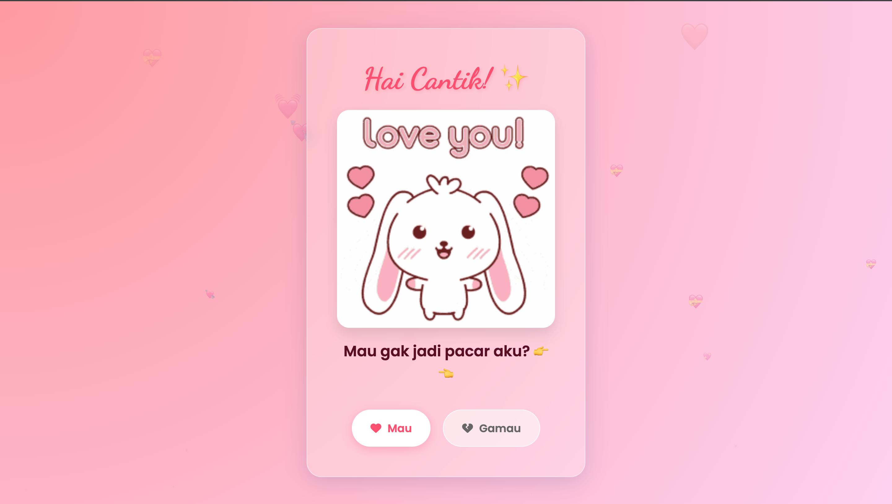

# 💝 Nembak Cewe HTML


> Sebuah website romantis, interaktif, dan premium yang dirancang khusus untuk membantu mengutarakan perasaanmu dengan cara yang paling berkesan.

## ✨ Fitur Utama

- **🎨 UI Glassmorphism Premium**: Desain modern dengan efek kaca transparan yang terlihat elegan dan mewah.
- **❤️ Suasana Romantis**: Latar belakang animasi hati yang melayang dan palet warna pastel yang lembut.
- **🏃‍♂️ Tombol "Gamau" yang Lincah**: Tombol penolakan yang secara otomatis menghindar dari kursor atau sentuhan, membuat cintamu tak bisa ditolak!
- **🎉 Mode Perayaan**: Saat si dia klik "Mau", layar akan meledakkan konfeti dan menampilkan popup anime couple yang lucu.
- **📱 Responsif Penuh**: Tampilan optimal di semua perangkat, mulai dari layar komputer besar hingga HP kecil (iPhone SE, dll).

## 🛠️ Teknologi yang Digunakan

- **HTML5**: Struktur semantik dan rapi.
- **CSS3**: Variabel custom, efek Glassmorphism, Layout Grid/Flexbox, dan animasi kompleks.
- **JavaScript (ES6+)**: Logika interaktif, manipulasi DOM, dan event handling.
- **Library Tambahan**:
  - [SweetAlert2](https://sweetalert2.github.io/): Untuk popup notifikasi yang cantik.
  - [Canvas Confetti](https://www.kirilv.com/canvas-confetti/): Untuk efek ledakan kertas warna-warni.
  - [FontAwesome](https://fontawesome.com/): Ikon vektor berkualitas.
  - [Google Fonts](https://fonts.google.com/): Menggunakan font 'Poppins' dan 'Dancing Script'.

## 📂 Struktur Proyek

Proyek ini disusun dengan rapi agar mudah dikembangkan:

```
/
├── index.html          # File utama
└── assets/
    ├── css/
    │   └── style.css   # Style yang sudah dipoles dan responsif
    ├── js/
    │   └── script.js   # Logika program dengan komentar penjelasan
    └── img/
        └── cute-couple.png # Aset gambar custom
    └── docs/
        └── screenshots/
            └── home.png # Screenshot preview
```

## 🚀 Cara Penggunaan

1.  **Download / Clone Repository**:
    ```bash
    git clone https://github.com/username/nembak-cewe-html.git
    ```
2.  **Buka File**: Klik dua kali `index.html` untuk membukanya di browser.
3.  **Customisasi**:
    - Edit `assets/js/script.js` untuk mengganti pesan sukses atau link redirect (misal: ke WhatsApp).
    - Ganti `assets/img/cute-couple.png` dengan fotomu sendiri jika mau.

## 🖼️ Pratinjau



---

Dibuat dengan ❤️ oleh **Handoko x Mari Partner**
